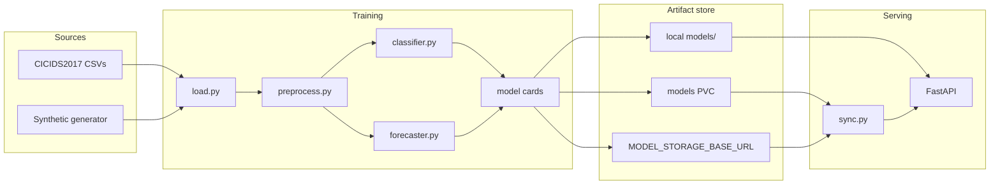
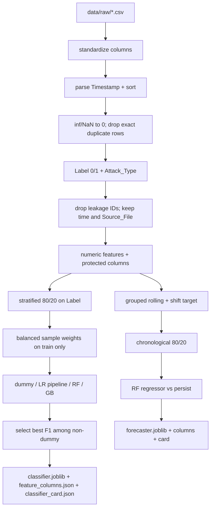
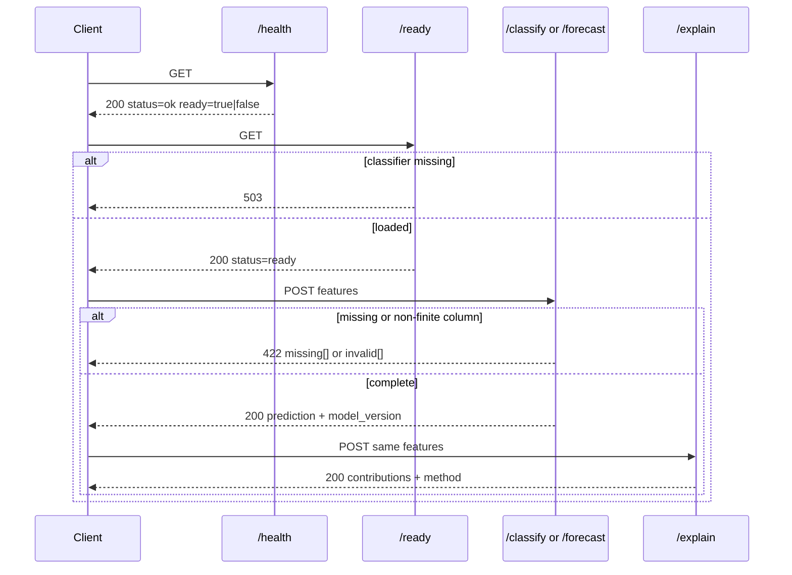
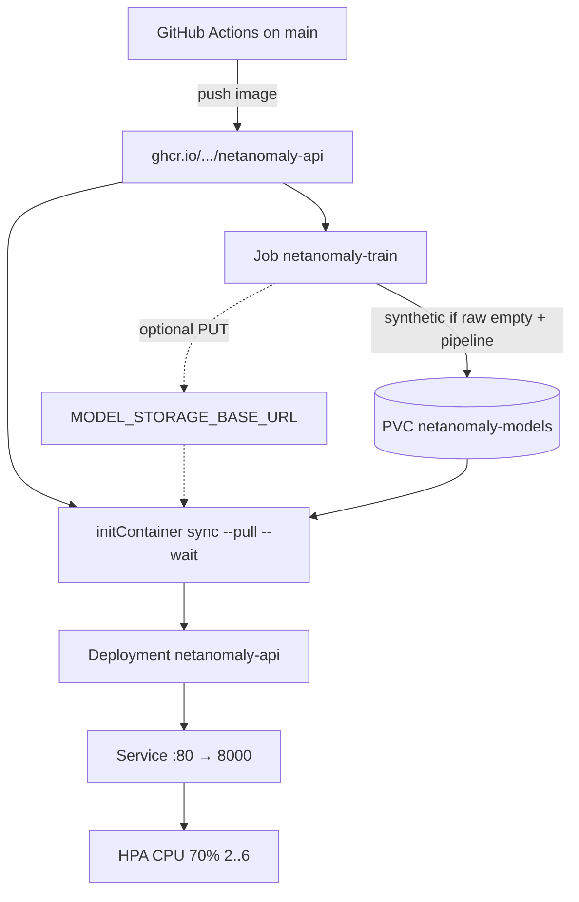

# Architecture

This document describes the system as implemented — not the thesis outline, and not a future design. It is the contract for how data, models, and the API fit together after the validity, service, and deploy work in this repo.

Source thesis: Tiwari, A. (2026). *Network Anomaly Detection and Traffic Forecasting Using Machine Learning and Sequence Models.* CSUN MSc.

## 1. Purpose

Netanomaly does two jobs on CICIDS-shaped **flow records** (one row = one bidirectional flow):

1. **Anomaly detection** — binary classification. `BENIGN` is 0; every other `Label` is 1. Original attack names are kept as `Attack_Type` so recall can be reported per class even though the served decision is binary.
2. **Traffic forecasting** — one-step regression of `Total_Length_of_Fwd_Packets`. A prediction at row *t* uses current-state features (including current volume) to estimate volume at *t + horizon* **inside the same source file**.

The served production models are classical sklearn artifacts (usually Random Forest for classification, Random Forest regressor for forecasting). A small Transformer exists only to reproduce the thesis result that it underperforms trees on this tabular data. It is not loaded by the API.

## 2. System context

Training and serving share one image. The image contains **code only**. Artifacts are written at train time and mounted or pulled at serve time.

## 3. Repository map

| Path | Role |
|---|---|
| `src/config.py` | Paths, leakage columns, non-feature columns, horizon, random seed |
| `src/data/load.py` | Concatenate `data/raw/*.csv`; stamp `Source_File` |
| `src/data/preprocess.py` | Column normalize, time sort, clean, labels, drop IDs |
| `src/data/generate_synthetic.py` | Overlapping, time-ordered CICIDS-shaped rows |
| `src/features/engineer.py` | Grouped rolling stats; group-aware target shift |
| `src/models/classifier.py` | Dummy + scaled LR + RF + GB; split then weight |
| `src/models/forecaster.py` | RF regressor; persist baseline |
| `src/models/transformer.py` | Optional sequence model; not served |
| `src/models/explain.py` | Instance contributions (coefficients or SHAP) |
| `src/models/artifacts.py` | `*_card.json` next to each joblib |
| `src/models/sync.py` | HTTP pull/push + wait for local files |
| `src/models/train_job.py` | Cluster/compose trainer |
| `src/models/latency.py` | Per-row inference timing |
| `src/api/main.py` | HTTP surface |
| `k8s/` | PVC, Job, Deployment, Service, HPA |
| `terraform/` | EKS scaffold; registry is GHCR |

## 4. Training pipeline

`python -m src.pipeline` (or `python -m src.models.train_job`) is a single pass over one preprocessed frame. Classification and forecasting **do not** re-preprocess separately.

### 4.1 Load

Every `*.csv` under `DATA_RAW_DIR` is read and stacked. `Source_File` is the basename. That column is the group key for rolling stats and for the forecast target shift, so Monday’s last row cannot become Tuesday’s first.

### 4.2 Preprocess

Order is fixed:

1. Strip / underscore column names (CICIDS `"Flow Duration"` → `Flow_Duration`).
2. Rename legacy `__source_file` → `Source_File`.
3. Parse `Timestamp`, drop unparseable rows, sort by time then file.
4. Replace ±inf with NaN; fill numeric NaN with 0. Datetime is not zero-filled.
5. Drop exact duplicate rows (CICIDS hygiene).
6. Store stripped original labels in `Attack_Type`; set `Label` to 0/1.
7. Drop leakage identifiers: flow id, IPs, source port. **`Timestamp` stays** until feature matrices are built.
8. Keep only numeric predictors plus protected columns (`Label`, `Attack_Type`, `Timestamp`, `Source_File`).

`run_preprocessing(..., balance=False)` is the default. Undersampling the **full** frame is still available but logs a warning: it would balance the holdout and inflate F1.

Protected columns never enter `joblib` feature lists (`drop_non_features`).

### 4.3 Classification

- Matrix: numeric features only. Stratified `train_test_split` on the binary label (`TEST_SIZE=0.2`, `RANDOM_STATE=42`).
- Holdout prevalence is the natural mix. Reported next to every metric.
- Real models fit with `compute_sample_weight("balanced")` on the **train** fold. The dummy most-frequent classifier is not weighted.
- Logistic regression is `StandardScaler` → `LogisticRegression` so the bake-off is not stacked in favor of trees.
- Metrics: precision, recall, F1, AUC-PR, confusion matrix, prevalence, per-attack recall (fraction of each `Attack_Type` predicted 1).
- `select_best` takes the highest F1 among non-dummy models.

### 4.4 Forecasting

- `add_statistical_features` computes rolling mean/std of `Total_Length_of_Fwd_Packets` **within `Source_File`**.
- `y[t] = volume[t + FORECAST_HORIZON]` via a group-wise shift. The last `horizon` rows of each file are dropped.
- `X` is numeric only (time / label / file / attack name stripped).
- Split is by row index after a global time sort: first 80% train, last 20% test.
- Persist baseline: current volume column predicts the next step. The summary includes `persist_mae`, `persist_rmse`, and `beats_persist`.

Current volume at *t* is a valid one-step feature. Future rows are not.

### 4.5 Artifacts

Written under `MODELS_DIR` (env-overridable):

| File | Contents |
|---|---|
| `classifier.joblib` | Chosen classifier (Pipeline or forest) |
| `feature_columns.json` | Exact `/classify` schema |
| `classifier_card.json` | version, created_at, model_name, feature_hash, metrics |
| `forecaster.joblib` | Regressor |
| `forecaster_feature_columns.json` | `/forecast` schema (includes roll_* columns) |
| `forecaster_card.json` | Same card shape, forecasting metrics |

`version` is a UTC timestamp (`YYYYMMDDTHHMMSSZ`) and is returned on API responses as `model_version`.

## 5. Serving

### 5.1 Request contract

`POST` bodies are `{"features": { "<column>": <float>, ... }}`.

- Every name in the trained column list must be present.
- Extra keys are ignored.
- Non-finite values are 422.
- Silent zero-fill of missing keys is not allowed.

`/explain` uses the same vector `/classify` just scored:

- Linear `Pipeline`: contribution = scaled value × coefficient (`method=coefficients`).
- Trees: SHAP `TreeExplainer` when `shap` is installed (`method=shap`); otherwise 501.

### 5.2 Process model

`MODELS` is filled once in the FastAPI lifespan from disk. There is no hot reload. Replace files and restart (or roll the Deployment) to pick up a new card/version.

Kubernetes:

- Liveness → `GET /health` (process up).
- Readiness → `GET /ready` (classifier loaded).
- Docker HEALTHCHECK hits `/ready`.

## 6. Deploy topology

Rules:

1. The API image never contains `classifier.joblib`.
2. First apply: `make k8s-train` then `make k8s-apply`. The init container waits up to 900s for required files on the PVC (or pulls them if `MODEL_STORAGE_BASE_URL` is set).
3. Later deploys only change the image tag. They do not retrain.
4. Secrets are optional. A token is only needed for authenticated HTTP pull/push.
5. The PVC is ReadWriteOnce, 2Gi. Fine on single-node kind/minikube with two replicas. Multi-node clusters need RWX or per-pod HTTP pull.
6. The trainer’s `/app/data` is an `emptyDir`. That is scratch for generated CSVs, not the model store.
7. CI registry is GHCR. Terraform provisions EKS only; it does not create a second registry.

`python -m src.models.sync`:

| Flag | Behaviour |
|---|---|
| `--pull` | GET `{base}/{filename}` for required + optional artifacts |
| `--wait` | Poll until `classifier.joblib` and `feature_columns.json` exist |
| `--push` | PUT local artifacts to the same prefix; no-op if URL unset |

Required names: `classifier.joblib`, `feature_columns.json`. Cards and the forecaster are optional.

## 7. CI/CD

On every pull request and on `main`:

1. `ruff check src tests`
2. `pytest tests/ -q` — includes a fixture that trains logistic regression + a small forecaster in a temp dir and asserts 422 / 503 / 200. Tests cannot skip the prediction path.

On `main` after tests:

3. Build and push `ghcr.io/<owner>/<repo>/netanomaly-api:{sha,latest}`.
4. If `KUBE_CONFIG` is a base64 kubeconfig, `kubectl apply` the kustomize overlay with that digest and wait for rollout. If the secret is missing, the job exits 0 and skips apply.

## 8. Configuration

| Variable | Default | Meaning |
|---|---|---|
| `DATA_RAW_DIR` | `data/raw` | Input CSVs |
| `DATA_PROCESSED_DIR` | `data/processed` | Optional preprocess dump |
| `MODELS_DIR` | `models` | Artifacts |
| `MODEL_STORAGE_BASE_URL` | empty | HTTP prefix for sync |
| `MODEL_STORAGE_TOKEN` | empty | Bearer token for sync |
| `TRAIN_ROWS` / `TRAIN_FILES` | 8000 / 2 | Synthetic size inside the k8s Job |

Column policy lives in `src/config.py`: `LEAKAGE_COLUMNS`, `NON_FEATURE_COLUMNS`, `TRAFFIC_VOLUME_COLUMN`, `FORECAST_HORIZON`.

## 9. Validity rules (do not regress)

These are the reasons the metrics are trustworthy. Tests lock them.

1. **Time is real.** `Timestamp` is not dropped as leakage. Synthetic files are written in order, one calendar day apart, never shuffled. Rolling and target shift do not cross `Source_File`.
2. **The holdout is not balanced.** Split first; weight or undersample train only. Prevalence on the test fold matches the frame.
3. **Baselines exist.** Dummy most-frequent cannot be selected as best. Forecast reports persist MAE. Scaled LR is in the bake-off.
4. **Synthetic classes overlap.** Attacks add signatures on a shared backbone; they are not a global 5× scale shift.
5. **The API does not invent features.** Missing keys are 422. `/ready` is 503 without a classifier.
6. **The image does not invent models.** No `COPY models`. Init + PVC or HTTP, or a local mount.

## 10. What is out of scope

- Multi-class serving (evaluation is per-attack; the decision is binary).
- Streaming / packet-level capture. Input is already-aggregated flows.
- Authn/z and rate limits on the API.
- Automatic retrain on a schedule.
- A production-sized serving model. The 200-tree forest and 512Mi limit are known tension; measure latency and RSS on CICIDS before you call it near-real-time.
- Apply-ready Terraform (VPC, subnets, and a remote backend are still yours to fill).

## 11. Local vs cluster

| | Local | Compose | Kubernetes |
|---|---|---|---|
| Data | `data/raw/` | bind `./data` | Job `emptyDir` or existing CSVs |
| Train | `make pipeline` | `make docker-train` | `make k8s-train` |
| Artifacts | `models/` | bind `./models` | PVC `netanomaly-models` |
| Serve | `make api` | `docker compose up api` | Deployment + `/ready` |
| Sync | unused | unused | init `--pull --wait` |
